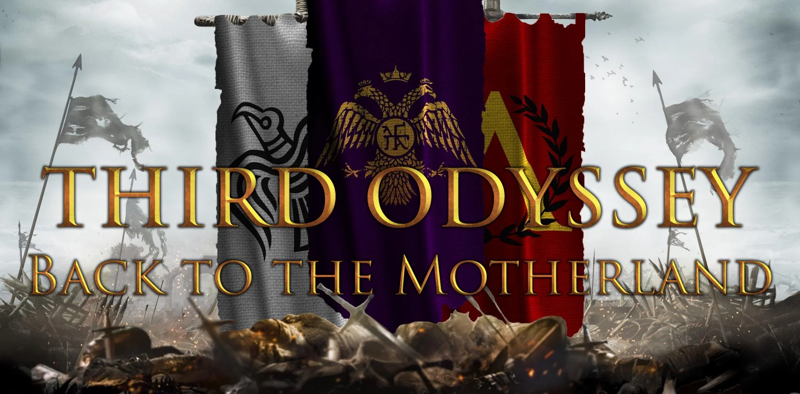

Explore the new world in an alternate history, as the true emperor of the romans embarks on a grand odyssey. Displace the unsuspecting natives, or harmonise with them. Encounter an unexpected but not unfamiliar rival in this new world. Build up your forces, and when the time is right, take back the motherland!

<pre>
</pre>

Source: <a href="https://github.com/Scurek/Third-Odyssey-Back-to-the-Motherland"><i class="large github icon "></i>Third Odyssey: Back to the Motherland</a>

